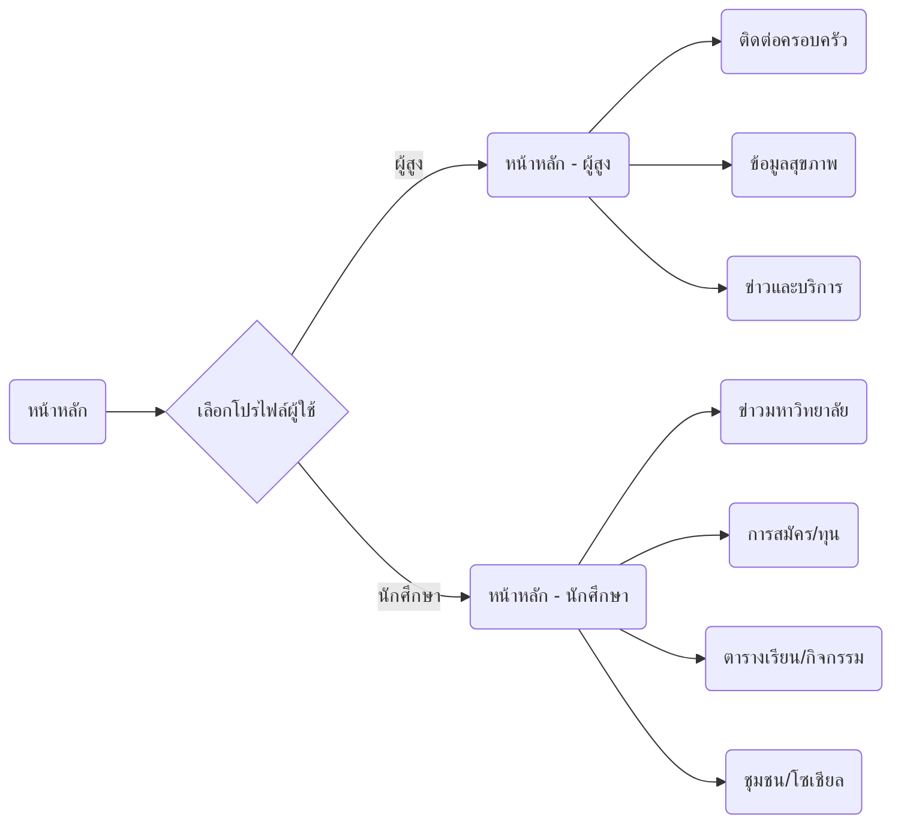

# บทสรุปผู้บริหาร  
งานวิจัยนี้มุ่งวิเคราะห์ความต้องการด้าน UX/UI สำหรับ **ผู้สูงอายุ (อายุ 60 ปีขึ้นไป)** และ **นักศึกษากำลังจะเข้ามหาวิทยาลัย (~17–18 ปี)** ในบริบทประเทศไทย โดยพิจารณาทั้งความแตกต่างทางด้านประชากรศาสตร์ (เช่น อายุ, เพศ, สภาพสังคม) และข้อจำกัดทางกายภาพ-ประสาทสัมผัส (สายตา, การได้ยิน, กล้ามเนื้อมือ, สติปัญญา) ของแต่ละกลุ่ม【31†L251-L262】【25†L91-L94】 นอกจากนี้ยังพิจารณาปัจจัยเรื่องความคุ้นเคยด้านเทคโนโลยี (การถือครองสมาร์ทโฟน, การใช้เน็ต) และพฤติกรรมการใช้งานหลักของผู้ใช้แต่ละกลุ่ม (เช่น การสื่อสารในครอบครัว, การค้นหาข้อมูลสุขภาพสำหรับผู้สูงอายุ และการเตรียมตัวเข้ามหาวิทยาลัย, งานโรงเรียน, ความบันเทิงสำหรับนักศึกษา)【31†L195-L204】【33†L168-L174】 ด้วยหลักการออกแบบที่ครอบคลุม (เช่น **การนำทางที่เข้าใจง่าย**, **ไทโปกราฟีใหญ่ชัดเจน**, **ความคมชัดของสีสูง**, **พื้นที่ปุ่มสัมผัสใหญ่**, **ไอคอนชัดเจน** และ **ภาษาเหมาะสม**) ตามแนวทาง WCAG 2.0, Apple และ Android ที่สำคัญ【17†L174-L182】【43†L25-L28】  รายงานนี้ยังเสนอเนื้อหากลยุทธ์และสถาปัตยกรรมข้อมูล (IA) ที่สอดคล้องกับกลุ่มเป้าหมาย รวมถึงวิธีทดสอบประเมินผล (usability tests, KPIs เช่น อัตราสำเร็จงาน, SUS, ระยะเวลา), เกณฑ์การสรรหาผู้เข้าร่วม, และประเด็นด้านเทคนิค (ประสิทธิภาพ, ระบบหลายภาษา, การทำงานแบบออฟไลน์, ความเข้ากันได้กับเทคโนโลยีช่วยเหลือ) ที่ควรคำนึง สรุปเป็นตารางเปรียบเทียบเพื่อให้เห็นข้อแตกต่างชัดเจน และมีการสาธิตแผนผังข้อมูลและหน้าจอจำลอง (wireframe) ในรูปแบบ **Mermaid Diagram** 

## โปรไฟล์ประชากรและความคุ้นเคยด้านเทคโนโลยี  
- **ผู้สูงอายุ (60 ปีขึ้นไป):** ประชากรไทยอายุ 60+ ประมาณ 13.1 ล้านคน (57.8% หญิง)【8†L112-L121】 กำลังเข้าสู่ “สังคมสูงวัย” อย่างรวดเร็ว. แม้ว่าสัดส่วนการถือสมาร์ทโฟนและใช้อินเทอร์เน็ตจะสูง (ราว 72% ใช้เน็ตอายุ 60–64 ปี, 93.7% ใช้มือถือ【8†L121-L124】) แต่จะลดลงเมื่ออายุมากขึ้น (กลุ่ม 80+ ใช้เน็ตเพียง 17.5%)【8†L121-L124】. ผู้สูงอายุไทยส่วนใหญ่สนใจแอปที่ช่วยในชีวิตประจำวัน เช่น การติดต่อครอบครัว, จัดการสุขภาพ (เช็คยา, บันทึกข้อมูลสุขภาพ), ข่าวสาร และบริการภาครัฐ (ตามรายงานสำรวจ ICT)【8†L121-L124】【47†L1168-L1172】. ปัจจุบันผู้สูงอายุในเมืองใหญ่ใช้อินเทอร์เน็ตและมือถือสูงกว่าผู้นอกเมือง (ใน กทม. สัดส่วนใช้อินเทอร์เน็ตสูงสุด 98.9%【25†L61-L69】) และผู้ชายสูงกว่าผู้หญิงเล็กน้อย【8†L112-L121】. แนวโน้มเทคโนโลยี: ผู้สูงอายุหลายท่านมีประสบการณ์อินเทอร์เน็ตระดับพื้นฐาน และมีความนิยมใช้แอปอย่าง LINE สูง【47†L1160-L1168】 (สถิติไทยชี้ 84.3% ผู้สูงถือสมาร์ทโฟน【28†L10-L12】). แต่มี “ช่องว่างดิจิทัล” ในกลุ่มเปราะบาง, ผู้สูงต่างจังหวัดอาจขาดอุปกรณ์หรือทักษะ【5†L9-L13】. 
- **นักศึกษากำลังเข้ามหาวิทยาลัย (17–18 ปี):** รุ่น Gen Z ที่เชี่ยวชาญด้านเทคโนโลยี ใช้งานอินเทอร์เน็ตและสมาร์ทโฟนเป็นปกติ (เกือบ 100% ใช้อินเทอร์เน็ต และถือสมาร์ทโฟน【25†L91-L94】【24†L840-L849】). เด็กไทยกลุ่มนี้เสพสื่อดิจิทัลสูงสุดในโลก【21†L20-L24】 และมีความคาดหวังสูงต่อประสิทธิภาพแอป. ในช่วงเตรียมเข้ามหาวิทยาลัย พวกเขาต้องการข้อมูลข่าวสารเชิงวิชาการ (การแนะนำคณะที่สนใจ, ขั้นตอนสมัคร), ช่วยด้านวางแผน (ปฏิทินสอบ, ตารางเรียน), สื่อสารกับเพื่อนร่วมรุ่น (เช่น กลุ่มโซเชียลมีเดียภายในมหาวิทยาลัย), ความบันเทิง และอาจรวมถึงเนื้อหาแนะแนวอาชีพ【33†L168-L174】. กลุ่มนี้พร้อมเรียนรู้และทดลองฟีเจอร์ใหม่ แต่ยังมีความอดทนน้อย “ต้องการความเร็ว”【35†L9-L12】, ใช้อินเตอร์เฟซที่ซับซ้อนได้พอสมควร แต่ไม่ชอบถูกสอนแบบเหยียดหรือคำพูดดูถูก (avoid condescending tone)【36†L7-L10】.   

| **คุณสมบัติ/พฤติกรรม**             | **ผู้สูงอายุ**                                                   | **นักศึกษา**                                                      |
|---------------------------------|-------------------------------------------------------------|-------------------------------------------------------------|
| ช่วงอายุ                         | 60+ ปี                                                         | ประมาณ 17–18 ปี                                                   |
| พื้นฐานเทคโนโลยี                | ผู้ถือมือถือ (74.7% มีมือถือ)【8†L112-L121】, ใช้งานเน็ต/สมาร์ทโฟนสูงแต่ลดลงกับอายุ  | แทบ 100% ใช้อินเทอร์เน็ตและมือถือ【25†L91-L94】【24†L840-L849】                  |
| อุปกรณ์หลัก                      | สมาร์ทโฟนขนาดใหญ่ (นิยมจับด้วยมือทั้งสอง)【3†L12-L17】           | สมาร์ทโฟนทุกรุ่น (ขนาดกระทัดรัด), บางคนใช้แท็บเล็ตหรือคอม            |
| ข้อจำกัดทางประสาทสัมผัส      | สายตาเสื่อม, ต้องการตัวหนังสือใหญ่และคอนทราสต์สูง【17†L174-L182】【17†L227-L239】  | สายตาปกติ, อ่านตัวอักษรขนาดปกติได้ ไม่เน้นคอนทราสต์มาก                           |
| ข้อจำกัดทางการเคลื่อนไหว      | กล้ามเนื้อมัดเล็กอ่อนแรง, แนะนำปุ่มใหญ่ (>48dp)【43†L25-L28】   | กล้ามเนื้อมือปกติ, ปุ่มมาตรฐาน (ประมาณ 44px) เพียงพอ                        |
| ระดับการรับรู้/จดจำ             | ความจำและสมาธิลดลง (เช่น หลายคนมีอาการหลงลืม)【9†L1-L4】 , ประสบการณ์เว็บน้อยกว่าเด็กและวัยหนุ่มสาว【4†L699-L708】 | กระบวนการคิดรวดเร็ว, เข้าใจง่าย, ระดับการอ่านอยู่ในระดับมัธยม-มหาวิทยาลัย【33†L168-L174】 |
| ทักษะการใช้แอป               | หลายคนพอใช้สมาร์ทโฟนได้ แต่หลีกเลี่ยงเทคโนโลยีซับซ้อน; มีปัญหากับไอคอนสากลบางอัน (เช่น “เมนูแฮมเบอร์เกอร์”)【4†L717-L722】 | ชำนาญใช้ฟีเจอร์พื้นฐาน, เปิดรับดีไซน์ใหม่ๆ เช่น gesture; คุ้นเคยกับ UI สมัยใหม่ |
| เป้าหมาย/ภารกิจหลัก             | ติดต่องาน/ครอบครัว, ค้นหาข้อมูลสุขภาพ, บริหารชีวิตประจำวัน (เช็คข่าวบ้านเมือง, ชำระบิลออนไลน์)【31†L195-L204】  | ศึกษาเตรียมมหาวิทยาลัย (ลงทะเบียน, ทุน, ปฏิทินวิชา), ติดตามข่าวสารนักเรียน, ความบันเทิง (เกม, เพลง)【33†L168-L174】 |

## ข้อจำกัดทางกายภาพ–ประสาทสัมผัส  
- **ผู้สูงอายุ:** การเสื่อมถอยตามวัยทำให้สายตาและการได้ยินลดลง【31†L243-L252】 จึงจำเป็นต้องใช้ฟอนต์ขนาดใหญ่ (WCAG แนะนำรองรับการปรับขนาดได้ถึง 200%【17†L174-L182】) สีที่คอนทราสต์สูง (WCAG AA 4.5:1)【17†L229-L239】 และหลีกเลี่ยงการใช้สีส่งข้อมูลเพียงอย่างเดียว【17†L227-L236】. สมองผู้สูงบางส่วนมีปัญหาความจำระยะสั้น (โรคสมองเสื่อม) ทำให้ควรลดภาระหน่วยความจำและคำสั่งทางเทคนิคซับซ้อน (เช่น ไม่ใช้ศัพท์เทคนิคมากเกินไป). การเคลื่อนไหวช้าลงและความคล่องนิ้วน้อยลง ทำให้ปุ่มควรใหญ่กว่ามาตรฐาน (อย่างน้อย 7–10 มม. หรือ 48–72dp)【43†L25-L28】【43†L74-L78】 และพื้นที่ระหว่างปุ่มต้องกว้างพอให้กดสะดวก. ระบบสัมผัส (Touch) ควรตอบสนองดี และป้องกันการสั่งงานผิดพลาดได้ (เช่น ลด gesture ซับซ้อน).  
- **นักศึกษา:** โดยทั่วไปไม่มีข้อจำกัดการมองเห็นหรือการเคลื่อนไหวเฉพาะ นอกจาก **ความอดทนน้อย** ต่อการรอโหลดเนื้อหา【38†L441-L449】. การจัดแสงและสีสามารถใช้ลูกเล่นได้มากกว่า (โทนสีสดใส หรือธีมสีสว่าง) ตราบใดที่ไม่ทำให้รบกวนสายตามาก. ฟอนต์ขนาดปกติ (~16–18px) เพียงพอ เพราะระดับสายตายังดี การใช้ฟอนต์แฟนซีเบาๆ สามารถใช้ได้ (ควรตรวจสอบว่าอ่านง่ายจริง).  

## พฤติกรรมการใช้เทคโนโลยีและอุปกรณ์  
- **ผู้สูงอายุ:** เกือบทั้งหมดใช้สมาร์ทโฟนเป็นหลัก พบว่า 85.0% ของผู้ชายสูงวัยและ 80.7% ของผู้หญิงมีโทรศัพท์มือถือและใช้งาน【8†L112-L121】. พวกเขามักถือโทรศัพท์ด้วยมือสองข้างและอาจใช้แท็บเล็ตหรือคอมพิวเตอร์สก์ท็อปบ้าง แต่ส่วนใหญ่จะเลื่อนดูเนื้อหาแบบตั้งตรง (portrait). แพล็ตฟอร์มยอดนิยมคือ **LINE**, Facebook, YouTube (สำหรับชมคลิป/เพลง) และแอปสุขภาพ (เช่น นับก้าว, เตือนกินยา). ผู้สูงอายุไทยมีอัตราการใช้อินเทอร์เน็ตสูงขึ้นในปัจจุบัน (56.7% ผู้ชาย 60+ ใช้เน็ต, มากกว่าผู้หญิง 49.3%)【8†L112-L121】 โดยกลุ่มที่อายุน้อยกว่า (60–64 ปี) ใช้งานเกือบ 72%【8†L121-L124】. อย่างไรก็ดี ผู้สูงบางรายให้เหตุผลว่า “ใช้ไม่เป็น/ทักษะต่ำ” จึงไม่ใช้งานเน็ต【25†L31-L34】.  
- **นักศึกษา:** กลุ่มวัยรุ่นนี้ถือสมาร์ทโฟน 95–100% (ตามการศึกษา)【25†L91-L94】【24†L840-L849】 โดยใช้ผ่านเครือข่ายมือถือหรือ Wi-Fi ทั้งในและนอกโรงเรียน. อุปกรณ์หลักคือ สมาร์ทโฟนด้วยสัดส่วนสูง (87.9% ที่มีเน็ตใช้มือถือสมาร์ทโฟน【21†L20-L24】) รองลงมาคือคอมพิวเตอร์พกพา/ตั้งโต๊ะ. เข้าถึงคลาวด์และโซเชียลมีเดียอยู่เสมอ และอาจใช้เทคโนโลยีใหม่ๆ (เช่น AI, AR) ในการเรียนหรือเล่น บางคนจะมีพื้นฐานภาษาอังกฤษดีจึงไม่กังวลเรื่องภาษามาก. วัยรุ่นนิยมนิยมแอปที่โหลดเร็ว ตอบโต้ทันใจ (เช่น ใช้ “สลับเร็ว-สัญญาณน้อย”).  

## ภารกิจและเป้าหมายการใช้งาน  
- **ผู้สูงอายุ:** ให้ความสำคัญกับ **การสื่อสารกับครอบครัวและชุมชน** (โทร, แชท, วิดีโอคอล), **การจัดการสุขภาพส่วนตัว** (ดูนัดหมายหมอ, แผนการกินยา), **การเข้าถึงข้อมูลและบริการ** (ข่าวท้องถิ่น, ข้อมูลหน่วยงานรัฐ, ค่าธรรมเนียม, e-Government) รวมถึง **ความบันเทิงง่ายๆ** (ฟังเพลง, ดูวิดีโอรีวิวท่องเที่ยว, เกมปริศนาแบบง่ายๆ). งานวิจัยของ Nielsen พบว่า ผู้สูงไทยใช้เน็ตเพื่อติดตามข่าว, ค้นหาเนื้อหาตามความสนใจ (เช่น ท่องเที่ยว, งานสังคม), จ่ายบิลออนไลน์, และสั่งของกิน (delivery)【31†L195-L204】. **ตัวอย่าง**: “ผมใช้เน็ตติดตามข่าวประจำวัน”, “ผมจ่ายบิลค่าสาธารณูปโภคออนไลน์”, “ผมใช้แผนที่นั่งรถไปสถานที่ใหม่ๆ”【31†L195-L204】【31†L212-L220】.  
- **นักศึกษา:** เนื่องจากยังเรียนไม่จบมหาวิทยาลัย, พวกเขาต้องการแอปที่ช่วย **เตรียมตัวเข้าเรียน** เช่น หาความรู้เกี่ยวกับคณะต่างๆ, การสมัครทุน, ตารางสอบ และคู่มือปฐมนิเทศ. นอกจากนั้นยัง **จัดระเบียบการเรียน** (ปฏิทินงานโรงเรียน, เตือนการบ้าน), **ค้นหาข้อมูลกิจกรรมนอกหลักสูตร** (ค่ายวิชาการ, กลุ่มเสวนา), **ติดตามข่าวสารเพื่อเยาวชน/มหาวิทยาลัย** และ **ความบันเทิง** (เกม, เพลง, วิดีโอยอดนิยม)【33†L168-L174】. โดยทั่วไปพวกเขามีเป้าหมายเฉพาะเจาะจงในการใช้เว็บ/แอป เช่น เข้าทำงานในปริศนาให้เสร็จ, ดูคลิปความบันเทิง, หาข้อมูลสมัครงานบ้าน, ฯลฯ【33†L168-L174】. ทั้งนี้ศึกษาพบว่าวัยรุ่นยังอ่านเนื้อหาได้น้อยกว่าผู้ใหญ่เล็กน้อย (ระดับการอ่านต่ำกว่าและสมรรถภาพการค้นหาเจาะจงยังพัฒนาไม่เต็มที่)【33†L168-L174】.

```mermaid
graph TB
subgraph ผู้สูงอายุ
  Start_O(เริ่มต้น) --> Home_O(หน้าหลัก)
  Home_O --> ContactFamily(ติดต่อครอบครัว)
  Home_O --> HealthInfo(ข้อมูลสุขภาพ)
  Home_O --> DailyTasks(บริการทั่วไป)
  Home_O --> ElderNews(ข่าวสารผู้สูงอายุ)
end
subgraph นักศึกษา
  Start_S(เริ่มต้น) --> Home_S(หน้าหลัก)
  Home_S --> UnivNews(ข่าวสารมหาวิทยาลัย)
  Home_S --> AdmissionInfo(ข้อมูลสมัครเข้า)
  Home_S --> ClassSchedule(ตารางเรียน)
  Home_S --> StudentSocial(เครือข่ายเพื่อน)
end
```

## แนวทางออกแบบ UX/UI

### การออกแบบสำหรับผู้สูงอายุ  
- **โครงสร้างการนำทาง (Navigation):** ควรเรียบง่ายและตรงไปตรงมา (flat navigation) โดยแสดงเมนูหลักหรือตัวเลือกสำคัญบนหน้าหลักทันที หลีกเลี่ยงการซ่อนในเมนูแบบแฮมเบอร์เกอร์ เพราะผู้สูงไทยมักสับสนกับไอคอนรูป “แฮมเบอร์เกอร์”【4†L699-L708】【47†L1168-L1172】. งานวิจัยชี้ว่าฟังก์ชันที่ใช้บ่อยควรอยู่ในหน้าแรก หรือติดป้ายชัด ไม่ควรมีรายการย่อยลึกมาก (avoid deep hierarchies).  
- **พิมพ์ภาณ์ (Typography):** ใช้ฟอนต์แบบเรียบง่าย อ่านง่าย (เช่น Sans-serif ที่รองรับภาษาไทย) ขนาดใหญ่ (อย่างน้อย 16–18pt ขึ้นไป) และรองรับการปรับขนาดตามระบบ (Dynamic Type/Accessibility)【17†L174-L182】. ไม่จัดเต็มในหน้าเดียวด้วยตัวหนังสือเล็กหรือเบา เพราะผู้สูงหลายคนบ่นว่า “ตัวหนังสือเล็กมากอ่านไม่ทัน”【31†L251-L259】. ควรเว้นระยะบรรทัดกว้างพอและประโยคสั้นๆ ชัดเจน (WCAG AAA แนะนำ *Visual Presentation* ให้เว้นระยะบรรทัดและใช้ตัวพิมพ์ใหญ่-เล็กตามหลักภาษา【17†L197-L205】).  
- **สีและคอนทราสต์ (Color/Contrast):** ใช้ชุดสีคอนทราสต์สูง (เฉพาะอย่างยิ่งข้อความบนพื้นหลัง เช่น Dark text on light background) เพื่อชดเชยการเสื่อมของการรับรู้สีที่มากับอายุ【17†L227-L239】. หลีกเลี่ยงสีจ้าเกินไป หรือลักษณะ “น้ำหนักสูง” เพราะแสงจ้าอาจเกะกะผู้สูง【18†L64-L67】. ควรมีโหมด high-contrast หรือโหมดกลางคืน (dark mode) ให้ผู้ใช้ปรับได้.  
- **เป้าสัมผัส (Touch Targets):** จัดให้ปุ่มและไอคอนมีขนาดอย่างน้อย 7–10 มม. (48×48dp)【43†L25-L28】 และเว้นขอบไม่น้อยกว่า 8dp ระหว่างกัน【43†L74-L78】. พื้นที่กดควรกว้าง ลดโอกาส “กดพลาด” ซึ่งเป็นปัญหาสำหรับผู้สูงที่มีดีพรอสทางกล้ามเนื้อน้อย.  
- **ไอคอนและป้าย (Icons/Labels):** ใช้ไอคอนที่ผู้สูงคุ้นเคยจริงๆ พร้อมมีป้ายคำอธิบาย (label) ชัดเจนเท่าที่จะทำได้. หลีกเลี่ยงสัญลักษณ์สากลที่ผู้สูงหลายคนไม่เข้าใจ (เช่น ไอคอนรูปตัวอักษร i, แฮมเบอร์เกอร์)【4†L701-L710】. จากงานวิจัยไทยพบว่า **ไอคอนคลุมเครือ** และ **ป้ายคำศัพท์ที่ไม่ชัดเจน** ทำให้ผู้สูงคลิกผิดบ่อย【47†L1162-L1172】.  
- **ภาษา/ถ้อยคำ:** ใช้ภาษาไทยง่ายๆ ชัดถ้อยชัดคำ, ถ้าใช้ศัพท์เทคนิคต้องมีคำอธิบายกำกับ ตัวอย่างเช่น แทนใช้ “Login” อาจใช้ “เข้าสู่ระบบ”. หลีกเลี่ยงสำนวนภาษาวัยรุ่นหรือคำย่อภาษาอังกฤษที่ผู้สูงไม่คุ้นเคย. โทนภาษาเป็นทางการและสุภาพกว่าเล็กน้อย เช่น “โปรดกรอกข้อมูล” แทน “กรอกหน่อย” เพื่อให้ผู้สูงรู้สึกน่าเชื่อถือ.  
- **การเริ่มต้นใช้งาน (Onboarding):** จัดให้มี **สอนการใช้งานทีละขั้น** (Tutorial) ตอนเปิดแอปครั้งแรก หรือมีปุ่ม “ช่วยเหลือ” ชัดเจน. แต่ต้องสามารถข้ามได้ง่ายหากไม่ต้องการ. ตัวอย่างเช่น นำแอปเข้าสู่โหมดลองใช้ (preview) โดยไม่มีขั้นตอนซับซ้อนเกินไป.  
- **การจัดการข้อผิดพลาด (Error Handling):** ให้ข้อความผิดพลาดเป็นภาษาไทยชัดเจน พร้อมแนวทางแก้ไข เช่น แทน “Invalid password” ใช้ “รหัสผ่านไม่ถูกต้อง กรุณาลองใหม่”【10†L1-L4】. ไม่ตัดสินหรือใช้ถ้อยคำกดดันผู้ใช้ (เช่น ห้ามบอกว่า “คุณผิด” แต่บอก “ไม่สำเร็จ กรุณาตรวจสอบข้อมูล” แบบให้กำลังใจ). รวมทั้งมีระบบยืนยันการทำงาน เช่น ปุ่ม “ย้อนกลับ” หรือ “ยกเลิก” ที่ชัดเจนง่ายต่อการแก้ไขข้อผิดพลาดได้ทันที.  
- **การแจ้งเตือน (Notifications):** ควรปรับให้เบาที่สุดและแจ้งเฉพาะเรื่องสำคัญ (เช่น นัดหมายยา, ข่าวฉุกเฉิน). หลีกเลี่ยงเสียงหรือแฟลชที่เกรี๊ยวกราด. เสนอ opt-in ให้เลือกประเภทการแจ้งเตือนได้ เช่น ข่าวสารทางการ, แจ้งเตือนสุขภาพ, โปรโมชั่นลดราคา.  
- **ความเป็นส่วนตัว/ความปลอดภัย:** ผู้สูงอายุอาจกังวลเรื่องความปลอดภัย (กลัวถูกหลอก/หลงระบบ). จึงควรย้ำความโปร่งใสในการขอข้อมูล เช่น อธิบายว่าทำไมต้องใช้กล้อง/ไมค์ (หากมี) และใช้ภาษาที่สร้างความเชื่อถือ (“แอปนี้ได้รับรองความปลอดภัย” หรือใช้สัญลักษณ์ lock ที่เข้าใจง่าย【4†L709-L717】). ในขณะเดียวกันควรไม่ซับซ้อนการปฏิบัติตัว (เช่น ยืนยันตัวตนให้ง่าย, อย่าขอ OTP บ่อยเกินจำเป็น). 

### การออกแบบสำหรับนักศึกษา  
- **โครงสร้างการนำทาง:** สามารถมีเมนูที่ซับซ้อนขึ้นได้บ้าง (เช่น แฮมเบอร์เกอร์เมนู, แถบด้านล่าง), เพราะกลุ่มนี้คุ้นเคยกับเว็บไซต์และแอปที่มีหลายหน้ามากขึ้น. อย่างไรก็ตาม ควรรักษาความเรียบง่ายพอสมควรโดยใช้รูปแบบที่นิยม (เช่น bottom navigation, แถบแท็บ) เพื่อให้เข้าถึงฟังก์ชันสำคัญได้รวดเร็ว.  
- **พิมพ์ภาณ์:** ใช้ฟอนต์ขนาดปกติที่อ่านง่าย (16–18px) และสามารถใช้ฟอนต์สไตล์แฟนซีหรือมีน้ำหนักต่างกันได้ (เพื่อลดความน่าเบื่อ) ตราบใด่มีความชัดเจน. เนื้อหาสำหรับนักศึกษามักมีปริมาณเยอะ จึงควรแบ่งเป็นคอลัมน์/หัวข้อชัดเจน ใช้หัวข้อย่อยและ bullet point เพื่อให้สแกนง่าย【45†L240-L249】.  
- **สีและดีไซน์:** สามารถใช้สีสันสดใสหรือล้ำสมัยได้ (ตามแบรนด์ของมหาวิทยาลัยหรือเทรนด์เยาวชน), แต่ยังต้องคำนึงถึงหลักคอนทราสต์และ accessibility พื้นฐาน. วัยรุ่นมักชื่นชอบธีมแบบร่วมสมัยและมีเอกลักษณ์ เช่น gradients หรือการออกแบบ flat-modern.  
- **เป้าสัมผัส:** ปุ่มและไอคอนควรตรงตามมาตรฐาน (อย่างน้อย 44×44px) และออกแบบเพื่อใช้งานบนมือถือ (touch-friendly). สามารถใช้ gesture ขั้นสูงได้บ้าง (เช่น swipe) เพราะนักศึกษาคุ้นเคย; แต่ควรมีทางเลือกอื่นด้วย (เช่น ปุ่มย้อนกลับ) เพื่อป้องกันความสับสน.  
- **ไอคอนและป้าย:** ใช้ไอคอนที่วัยรุ่นรู้จักดี (เช่น สัญลักษณ์ home, menu, profile) โดยไม่จำเป็นต้องเขียนคำบรรยายทับทุกไอคอน แต่ควรมี label ชื่อหมวดเมนูเพื่อความชัดเจน (อย่างน้อยในเมนูหลัก). คำศัพท์ทางเทคนิคพื้นฐาน เช่น “Profile”, “Campus Map” สามารถใช้ได้ ถ้าออกแบบให้เข้าใจง่าย.  
- **ภาษา/ถ้อยคำ:** สามารถใช้ภาษาไทยร่วมกับคำภาษาอังกฤษสั้นๆ ที่เข้าใจกัน เช่น “Login”, “Profile” ได้บ้าง, และอาจใช้สำนวนเป็นกันเองขึ้น เช่น ใช้คำย่อวัยรุ่นเล็กน้อยถ้าเหมาะ (caution: หลีกเลี่ยงภาษาที่ดูเด็กเกินไปในทางการ). คำชี้แจงควรกระชับและทันสมัย; ไม่พูดลงท้ายด้วยสุภาพคำแก่ (“ครับ/ค่ะ”) ก็ได้ เพราะวัยรุ่นอาจไม่ให้ความสำคัญมาก.  
- **การเริ่มต้นใช้งาน:** เนื่องจากวัยรุ่นค่อนข้างฉลาดด้านเทคโนโลยีและใจร้อน, จึงควรทำ Onboarding ให้รวบรัด ห้ามเรียงขั้นตอนนานๆ ให้สามารถข้ามได้ทันที (“ข้ามไปเลย” หรือ login)【36†L7-L10】. ถ้ามีจุดเด่นในแอป ควรยกมาอธิบายสั้นๆ ผ่านภาพนิ่งสไลด์ (typical slide show), ไม่ต้องย้ำข้อมูลที่ไม่น่าสนใจ.  
- **การจัดการข้อผิดพลาด:** ข้อความผิดควรกระชับ (Thai/Eng ได้บ้างเช่น “Invalid input” เข้าใจได้ในหมู่วัยรุ่น), มีโทนไม่ตึงเครียด ชี้แจงขั้นตอนถัดไป อาจใช้อีโมจิช่วยให้ดูเป็นมิตร. นักศึกษามีความอดทนต่ำ, เวลาส่ง error ห้ามช้า (immediate feedback).  
- **การแจ้งเตือน:** สามารถใช้บ่อยกว่าเช่น เตือนการบ้าน, ประกาศ, กิจกรรมต่างๆ. ควรมีการตั้งค่าจัดการง่าย (เปิด/ปิดประเภทได้). เนื้อหาใน notification ควรน่าสนใจ (ตัวอย่าง: แสดงรูปหรือ preview).  
- **ความเป็นส่วนตัว:** นักศึกษาอาจไม่กังวลเรื่องข้อมูลส่วนตัวเท่าผู้สูง แต่ยังคงคำนึงถึงความเชื่อถือ (อัพเดทข่าวสารเทียบกับ RSS feed)【38†L472-L481】. จึงควรทำให้เข้าใจง่ายว่าแอปจะเก็บ/ใช้ข้อมูลอะไร (อาจมี policy ลิงก์สั้นๆ) และอนุญาตง่าย (เช่น "Remember me", ไม่ต้องกด OTP บ่อยๆ ถ้าไม่จำเป็น).  

## เนื้อหาและสถาปัตยกรรมข้อมูล (Information Architecture)  
- **กลยุทธ์เนื้อหา:** เนื้อหาทั้งสองกลุ่มควรเขียนให้อ่านง่าย, สั้น, ไม่เวิ่นเว้อมาก (short paragraphs, bullet, highlights)【45†L240-L249】. ตัวอักษรและภาพต้องใหญ่ชัด (โดยเฉพาะผู้สูง)【4†L674-L683】【17†L174-L182】. ภาพประกอบและวิดีโอใช้ได้ แต่ผู้สูงไม่ชอบวิดีโอสั่นๆ ไม่นิ่ง (prefers static images)【4†L680-L683】. นักศึกษาชอบ multimedia มากกว่า (video, animation) แต่หลีกเลี่ยง autoplay เสียงดังที่รบกวน (ตามตารางอายุ【38†L431-L440】).  
- **สถาปัตยกรรมข้อมูล:** ควรแบ่งเนื้อหาเป็นหมวดใหญ่ชัดเจน เช่น หน้าแรกที่แยกเมนูหลัก (ติดต่อ, สุขภาพ, ข่าวสาร). สำหรับผู้สูง หลีกเลี่ยงเมนูย่อยหลายชั้น, ทุกฟังก์ชันหลักควรเข้าถึงได้ภายใน 1-2 ก้าว【47†L1162-L1172】. สำหรับนักศึกษา อาจมีโครงสร้างหลายชั้นได้ แต่ควรมี breadcrumb หรือชี้ทางกลับง่าย. หน้าจออาจมีโซนเนื้อหา (header, menu, content) เพื่อให้คาดเดาตำแหน่งของข้อมูล.  
- **ระบบนำทางและผังเว็บไซต์ (Site Map):** ตัวอย่าง IA คร่าวๆ เช่น หน้าหลัก → (ผู้สูง: ติดต่อ-ข่าวสาร-สุขภาพ) / (นักศึกษา: ข่าวมหา’ลัย-สมัครเรียน-ตาราง). การวางระบบอาจใช้แบบ **Landing Page เดียว แต่ปรับเนื้อหาไดนามิค** ตามโปรไฟล์ผู้ใช้ (หรือปุ่มตั้งค่าโหมด “ผู้สูง” vs “ปกติ”). MerDiagram ด้านล่างแสดงตัวอย่างการเชื่อมโยง. 



## การทดสอบและตัวชี้วัด (Metrics)  
- **วิธีทดสอบ:** ใช้ **การทดสอบการใช้งาน (Usability Testing)** แบบมีผู้ควบคุม (moderated) และไม่มผู้ควบคุม (unmoderated) ร่วมกัน. คัดเลือกตัวแทนผู้สูงอายุและนักศึกษาต่างกลุ่มกัน (แนะนำผู้สูง 5–8 คน ในหลายระดับอายุ 60-75 ปี, นักศึกษา 5–8 คน อายุตามกลุ่ม). ใช้ **Think-Aloud Protocol** เพื่อให้ผู้ใช้พูดบรรยายสิ่งที่คิดในขณะใช้งาน. สถานการณ์ทดสอบควรสะท้อน **งานจริง**: เช่น ให้ผู้สูงอายุค้นหาข้อมูลแพทย์และส่งข้อความให้ลูก, ให้นักศึกษาค้นหาเรื่องทุนและดูตารางสอบ.  
- **ตัวชี้วัดหลัก (KPIs):** ประเมินจาก (1) **อัตราสำเร็จงาน** (Task Success Rate) (เช่น กี่คนทำภารกิจได้สำเร็จเต็ม 100%), (2) **เวลาทำงานเฉลี่ย**, (3) **จำนวนข้อผิดพลาด/คลิกผิด**, (4) **คะแนนความพึงพอใจผู้ใช้** (ผ่านแบบสอบถาม SUS หรือ NPS), (5) **ความพยายาม/ปฏิกิริยา** (เช่น NASA-TLX วัดภาระสมอง). **เกณฑ์ผ่าน** อาจกำหนดเช่น อัตราสำเร็จ ≥ 90% และคะแนนความพึงพอใจ ≥ 4/5.  
- **เกณฑ์การสรรหาผู้ทดสอบ:**  
  - *ผู้สูงอายุ:* อายุ 60+ ปกติ/มีสายตาไม่สมบูรณ์เล็กน้อย หรือเคยถือสมาร์ทโฟน, ไม่จำเป็นต้องเคยใช้งานแอปมาก่อน. ควรมีทั้งระดับการศึกษาและภูมิภาคต่างๆ (เมือง/ชนบท).  
  - *นักศึกษา:* อายุ 17–18 ปี กำลังเรียนชั้น ม.6 หรือใหม่ล่าสุด ใกล้จบ, มีมือถือใช้เป็นประจำ. ควรเก็บหลากหลายสาขา (สายวิทย์-คณิต, สายศิลป์, ต่างจังหวัด/กทม).  
  - ควรคัดกรองให้ไม่มีโรคทางประสาทรุนแรง (สมองเสื่อม, บกพร่องสายตารุนแรง) เพื่อความเป็นธรรม.  

## การพิจารณาทางเทคนิคและการปรับใช้  
- **ประสิทธิภาพ (Performance):** แอปต้องเร็วและตอบสนองดีบนอุปกรณ์รุ่นเก่า-ใหม่ ลดจำนวนภาพขนาดใหญ่ (ใช้การบีบอัดเช่น WebP) และ lazy load เฉพาะเนื้อหาที่ผู้ใช้ต้องการดูจริงๆ【45†L223-L233】. ใช้ **Skeleton Screens** หรือ placeholder แทนการแสดงหน้าว่าง, เพื่อให้ผู้ใช้รู้ว่าข้อมูลกำลังโหลด【45†L208-L219】.  
- **การรองรับหลายภาษา (Localization):** ใช้ข้อความภาษาไทยเป็นหลัก ทั้ง UI, ข้อความแจ้งเตือน, ช่วยเหลือ. ตรวจสอบให้รองรับอักขระไทย (เช่น ฟอนต์ “Sukhumvit” ใน iOS เริ่มต้นตั้งแต่ iOS7)【39†L0-L4】. ควรมีระบบปรับขนาดแบบ Dynamic Text ของระบบปฏิบัติการ (iOS Adaptive, Android Accessibility) เพื่อให้ผู้ใช้เพิ่มขนาดตัวอักษรได้. หากโอกาส, รองรับภาษาอังกฤษแบบสนับสนุนด้วย (นักศึกษาที่แข็งภาษาอังกฤษ).  
- **การทำงานแบบออฟไลน์:** ควรเก็บข้อมูลสำคัญไว้ในเครื่อง (caching) เพื่อให้แอปบางฟังก์ชันยังใช้งานได้เมื่อไม่มีเน็ต【45†L250-L259】. ตัวอย่างเช่น เมนูหลัก, ข่าวสารล่าสุดที่เคยดาวน์โหลด, ข้อมูลบัญชีผู้ใช้ ให้แสดงได้แม้ออฟไลน์. แสดงแจ้งสถานะชัดเจนเมื่อออฟไลน์ เช่น “ไม่สามารถเชื่อมต่อระบบ, จะแสดงข้อมูลล่าสุด”【45†L297-L304】. ใช้การซิงก์ข้อมูลเมื่อกลับออนไลน์ (auto-sync) เพื่อให้ผู้ใช้ไม่สูญเสียงาน/ข้อมูล. สำหรับผู้สูงอายุที่บางพื้นที่เน็ตไม่เสถียร, โหมดออฟไลน์นี้สำคัญมาก.  
- **เทคโนโลยีช่วยเหลือ (Assistive Tech Compatibility):** ออกแบบให้รองรับหน้าจออ่านออกเสียง (screen readers) เช่น VoiceOver (iOS) และ TalkBack (Android): ใส่ **aria-label** ให้ไอคอน, ปุ่ม มีคำอธิบายแต่ละฟังก์ชัน. รองรับ **โหมดสัมผัสทางเลือก** เช่น การนำทางด้วยปุ่ม keyboard หรือ switch control สำหรับผู้ใช้งานที่ต้องการ. รองรับการ **ปรับคอนทราสต์** และ **โหมดสีสูง** (WCAG). ใช้ semantic HTML/markup (เช่น `<button>`, `<nav>`, `<header>`) บนเว็บ เพื่อให้ assistive tech เข้าใจโครงสร้าง【18†L54-L61】.  
- **ข้อพิจารณาอื่นๆ:** ตรวจสอบ UX บนอุปกรณ์ที่หลากหลาย (จอเล็ก, จอใหญ่, iOS vs Android). ปรับแต่งให้เหมาะกับชาวไทย เช่น ปฏิทินไทย, หน่วยเงินไทย, คำนำหน้าชื่อไทย. ทดสอบความเข้ากันได้กับอุปกรณ์รุ่นเก่า เช่น Android Go, เพื่อครอบคลุมผู้สูงในชนบท.  

## ทางเลือกการออกแบบ: แอปเดียว vs โหมดแยก  
- **แอปเดียว (รวมทุกฟีเจอร์):** ข้อดีคือ บำรุงรักษาโค้ดชุดเดียว, ไม่ต้องสลับแอป, ใช้ฐานข้อมูลร่วมกัน (ลดต้นทุน). แต่ข้อเสียคือ UI อาจซับซ้อนเกินไป หรือผู้ใช้กลุ่มหนึ่งต้องเจอฟีเจอร์ที่ไม่จำเป็น (ความสับสน). ถ้าเลือกทางนี้ควรมีระบบสลับโหมด (เช่น “โหมดง่าย” สำหรับผู้สูง) หรือปรับการแสดงผลตามโปรไฟล์ (dynamic).  
- **แยกแอป/โหมด:** สร้างสองโฟลว์ (ผู้สูง vs เด็ก) ช่วยให้ออกแบบโฟกัสไปที่ฟังก์ชันของแต่ละกลุ่ม ตัวอย่างเช่น มีปุ่มสลับ UI (Switch to Elder Mode) บนแถบเมนู. ข้อเสียคือเพิ่มค่าออกแบบและบำรุงรักษา.  
- ในการออกแบบจริง อาจผสมผสาน: ใช้โครงสร้างฐานข้อมูลเดียว แต่โซน UI แยกโดยผู้ใช้เลือกโปรไฟล์ตอนแรก (เช่น diagram ด้านบน). หรือทำ progressive disclosure (ฟีเจอร์ขั้นสูงเป็นกลุ่มลับ “สำหรับนักศึกษา”) เพื่อไม่รบกวนผู้สูง.  

## ตารางเปรียบเทียบบางคุณลักษณะสำคัญ  

| **องค์ประกอบ/ฟีเจอร์**           | **ผู้สูงอายุ**                                               | **นักศึกษา**                                             |
|---------------------------------|---------------------------------------------------------|-------------------------------------------------------|
| การนำทาง                        | เมนูเรียบง่าย (flat, icon+text ชัดเจน), หลีกเลี่ยง Hamburger【47†L1162-L1172】 | เมนูหลัก, Hamburger, Tab Bar ใช้ได้, รองรับ multi-tabs (เพราะนักศึกษาคุ้นเคย)【38†L463-L472】 |
| ขนาดตัวอักษร                   | ใหญ่ (อย่างต่ำ 16–18pt)【17†L174-L182】, รองรับปรับขนาด (dynamic) | ปานกลาง (14–16pt) ปรับได้บ้างตามต้องการ               |
| สี/กราฟิก                       | คอนทราสต์สูง, ใช้โทนสุภาพ (soft tone)【17†L229-L239】           | สีสันสดใส, เทรนด์วัยรุ่นได้, อาจใช้รูปแบบกราฟิกแฟนซี    |
| พื้นที่ปุ่ม (Touch Target)      | ใหญ่ (≥48–72dp)【43†L25-L28】, เว้นห่างอย่างน้อย 8dp       | มาตรฐาน (≈44dp), บางจุดคับแน่นขึ้นได้เล็กน้อยเพราะคุ้นมือ  |
| ไอคอน                           | ใช้ภาพ/ไอคอนชัดเจน, มีป้ายคำ (avoid ambiguous)【47†L1162-L1172】 | ใช้ไอคอนสากลทั่วไป, ไม่ต้องมีป้ายทุกตัว (แต่ชี้นำง่าย)  |
| ภาษา/สำนวน                     | ธรรมดา, สุภาพ, หลีกเลี่ยงศัพท์วัยรุ่น, label ชัดเจน       | กึ่งทางการ/ไม่เป็นทางการปนกัน, ใช้คำย่อ/เทรนด์ได้บ้าง    |
| Onboarding                      | สอนทีละขั้น, เน้นวิดีโอหรือรูปภาพอธิบาย, ข้ามง่ายได้        | หน้าปัดสั้นๆ, อาจไม่ต้อง (ให้กด skip ไปเลยก็ได้)【36†L7-L10】 |
| Error Messages                  | อธิบายชัด, สุภาพ (ไทยเต็มรูปแบบ)                            | สั้น กระทัดรัด (Thai/Engผสม ok), ใช้ emoji ช่วยได้       |
| Notifications                   | แจ้งเรื่องสำคัญเท่านั้น, เบานุ่ม, ตั้งค่าได้             | แจ้งบ่อยได้ (ข่าว, เตือนกิจกรรม), ตั้งค่ารายการได้     |
| ความปลอดภัย/ความเป็นส่วนตัว    | เน้นสร้างความเชื่อมั่น (เช่น ไม่มีโฆษณาหลอก, อธิบายเหตุผลขอข้อมูล) | เน้นฟังก์ชันที่ชัดเจน, ให้ความไว้วางใจง่ายกว่า, แต่ยังต้องแจ้งให้ชัดเจน |
| ฟังก์ชันหลัก (ตัวอย่าง)         | โทร/ข้อความหาญาติ, ค้นหาหมอ/คลินิก, บริการภาครัฐ, ดูข่าว   | มหาวิทยาลัย (ข่าว, สมัคร), ตารางเรียน, ชุมชนรุ่น, เรียนออนไลน์ |
  
**หมายเหตุ:** ตารางนี้สรุปคุณสมบัติและองค์ประกอบหลักที่ควรออกแบบให้ต่างกันระหว่างสองกลุ่ม【4†L674-L683】【43†L25-L28】.  

## ข้อสรุป  
การออกแบบ UI/UX สำหรับผู้สูงอายุและนักศึกษาไทยต้องคำนึงถึงความแตกต่างชัดเจนทั้งทางกายภาพและพฤติกรรม ผู้สูงอายุต้องการอินเตอร์เฟซเรียบง่าย ตัวหนังสือใหญ่ คอนทราสต์สูง และการนำทางตรงไปตรงมา เพื่อชดเชยการเสื่อมถอยทางประสาทสัมผัส【31†L251-L262】【47†L1162-L1172】. ในขณะที่นักศึกษามักต้องการประสบการณ์ที่รวดเร็ว โต้ตอบได้หลากหลาย ใช้สีสันและการนำเสนอเนื้อหาที่น่าสนใจ【35†L9-L12】【36†L7-L10】. การออกแบบจึงอาจเลือกใช้ **แอปเดียวแต่ปรับโหมด** หรือ **แยกโครงร่าง UI** ที่แตกต่างกัน ตามทรัพยากรและกลยุทธ์องค์กร. เอกสารนี้รวบรวมข้อเท็จจริงล่าสุดจากแหล่งวิจัยไทยและแนวปฏิบัติระดับสากล (WCAG, Material, Apple) เพื่อเป็นแนวทางวางรากฐาน UX/UI ที่ครอบคลุมและยืดหยุ่นสำหรับทั้งสองกลุ่มเป้าหมาย.  

**ที่มา:** หลักเกณฑ์ WCAG 2.0, เอกสารแนะนำ Android/iOS Accessibility【17†L174-L182】【43†L25-L28】, งานวิจัยและบทความไทยเกี่ยวกับการออกแบบสำหรับผู้สูงอายุ【47†L1162-L1172】【4†L674-L683】 และกลุ่มวัยรุ่น【33†L168-L174】【38†L441-L449】, รวมถึงรายงานสำรวจสถิติโทรคมนาคมและ ICT ของสำนักงานสถิติแห่งชาติ【8†L112-L121】【25†L91-L94】.